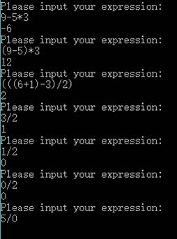

# 编译原理实验一 #
9/29/2017 6:35:11 PM 

## 代码测试结果 ##

## 编程思路 ##
- 两个栈分别存放操作数及操作符

	> stack<char> ops;  
	> stack<int> nums;

- 读取表达式字符串，遇到操作数直接入栈
	
> for (int i = 0; i < int(exp.length()); i++) {

> 		char ch = exp[i];  
> 		if (!isOperator(ch)) {  
> 			numTemp.push_back(ch);  
> 		}
- 遇操作符入栈规则
	- 若优先级比栈顶操作符高或为“（”，直接压栈	
	- 若优先级比栈顶操作符低，弹出栈顶元素	
	- 若为“）”，则操作符栈弹出操作符，直到弹出“（”	
	

> case ')':  
> 				while (ops.top() != '(') {  
> 					calculate(ops, nums);  
> 				}  
> 				ops.pop(); //pop (  
> 				break;  
> 			default:
> 				if (ops.size() == 0) ops.push(ch);  
> 				else {  
> 					while ((ch == '+' || ch == '-') && ops.size() != 0 && (o
> ps.top() == '*' || ops.top() == '/')) {  
> 						calculate(ops, nums);  
> 					}  
> 					ops.push(ch);  
> 				}
	
- 每弹出一个操作符，弹出两个操作数，计算结果	再压入操作数栈，直至操作符栈为空

> void calculate(stack<char>& operators, stack<int>& operands) {  
	char ch = operators.top();   
	int num1 = operands.top();    
	operands.pop();  
	int num2 = operands.top();  
	operands.pop();  
	int result;  
	switch (ch) {  
	case '+':  
		result = num1 + num2;   
		break;  
	case '-':  
		result = num2 - num1;  
		break;  
	case '*':  
		result = num2 * num1;  
		break;  
	case '/':  
		result = num2 / num1;    
		break;  
	}  
	operands.push(result);   
	operators.pop();  
}
